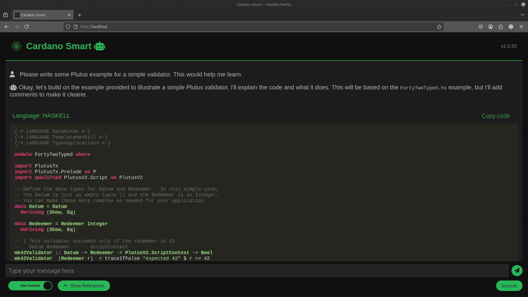

# Cardano Smart

Cardano Smart is an open-source project that integrates with [PrivateGPT](https://github.com/zylon-ai/private-gpt) to provide a comprehensive solution for LLM driven chat bot for Cardano documentation.

## Table of Contents

- [Features](#features)
- [Video Instructions](#video-instructions)
- [FAQ](#faq)
- [Private Kubernetes Setup](#private-kubernetes-setup)
- [Docker Setup](#docker-setup)
- [Troubleshooting](#troubleshooting)
- [Architectural Diagrams](#architectural-diagrams)
- [Contribution](#contribution)
- [License](#license)
- [Acknowledgements](#acknowledgements)


## Features

- **Seamless Integration:** Offers both frontend and backend setup to ensure a smooth user experience.
- **Flexible Deployment Options:** Includes configurations for Google Cloud's Kubernetes Engine, local Docker setups, and private Kubernetes clusters.
- **Enhanced Accessibility:** Utilizes advanced GPU resources for intensive computational tasks, making it ideal for data-heavy operations.

## Video instructions

Here is a video tutorial for Docker and Kubernetes setups
[](https://www.youtube.com/watch?v=x6Suvoqor3M)

## FAQ

See the [FAQ](FAQ.md) file for more information.

## Private Kubernetes Setup

### Prerequisites

- Kubernetes cluster
- At least one node
- At least one nVidia GPU node (could be single node in cluster)
- Dockerhub account or other container registry account

### Building images

At first we have to build images for doc-scraper, frontend and privateGPT.
There are build scripts for each of them located in `build_scripts` folder.

```
build_scripts
├── build_doc_scraper.sh
├── build_frontend.sh
└── build_private_gpt.sh
```

Before building images, make sure you have Dockerhub account and are logged in.
To log in, run `docker login` and provide your credentials.

#### Doc-scraper

```bash
./build_scripts/build_doc_scraper.sh
```

#### Frontend

```bash
./build_scripts/build_frontend.sh
```

#### PrivateGPT

When building privateGPT image, we can optionally provide model name.
For example:

```bash
./build_scripts/build_private_gpt.sh "deepseek-r1"
```

If we don't provide model name, it will use default one - `llama3.2:1b`.

So we can do this instead:

```bash
./build_scripts/build_private_gpt.sh
``` 

There are other models you could try, for example: `mistral`, `qwen2.5`, etc. All models that are supported by [ollama](https://ollama.com/library) is suppored here.

### Deployment

The whole setup consists of 3 Kubernets deployments:

- frontend-deployment
- ollama-deployment
- privateGPT-deployment

There are also 2 CronJobs:

- doc-scraper-cronjob
- restart-private-gpt

To start working with Kubernetes deployments, you should `cd` into kubernetes folder.

```bash
cd kubernetes
```

You can install the whole setup using automatic installation by running:

```bash
./install-cardano-smart.sh
```

or manually.


### Local Manual Kubernetes Setup

First of all you need yo have a Kubernetes cluster and the access to it with `kubectl` command.
Once you have that, you can apply the configurations to deploy all necessary services.

#### Namespace

First of all you need to create a namespace for your services.

```bash
kubectl apply -f namespace/namespace.yaml
```

#### Storage

We will need to create a common persistent volume for privateGPT and doc-scraper. This volume will be shared between them.

```bash
kubectl apply -f storage/pv.yaml
kubectl apply -f storage/pvc.yaml
```

#### Frontend

Let's create a deployment for frontend.

```bash
kubectl apply -f frontend/deployment.yaml
```

Now we need to make a decision about the service type. If we are gonna use `LoadBalancer` type, we need to use a `service-load-balancer.yaml` file. But if we are gonna use `NodePort` type, we need to just use `service.yaml` file.
The main difference is that `LoadBalancer` will let you access Cardano Smart using pre-set IP address with default port number 80. And the NodePort will let you access it using the IP address of any node and the port number.

In this guide we will be using `LoadBalancer` type.
Before applying the service, you need to change the IP address in the `service-load-balancer.yaml` file in the field `loadBalancerIP` to something that is valid in your network.

```bash
kubectl apply -f frontend/service-load-balancer.yaml
```

#### Ollama

Let's create a deployment for ollama. Please note that if you already have ollama running on your cluster, you would rather need to change the settings in `private_gpt_k8s_configs/settings-docker.yaml` file. There are two settings under ollama block: `api_base` and `embedding_api_base`. Then you would need to rebuild the private-gpt image.

To install ollama, you could run the `install-ollama.sh` script.

```bash
./install-ollama.sh
```

or you could install it manually.

```bash
kubectl create namespace ollama
kubectl apply -f ollama/deployment.yaml
kubectl apply -f ollama/service.yaml
kubectl apply -f ollama/ingress.yaml
```

#### Doc-scraper

Let's create a deployment for doc-scraper.

```bash
kubectl apply -f doc-scraper/cronjob.yaml
```

Now we need to run the initial scrape.

```bash
kubectl apply -f doc-scraper/init-doc-scraper.yaml
```
Now we should wait for the scrape to finish. We can check the status by running:

```bash
kubectl get jobs --namespace cardano-smart 
```

You should see something like this:

```
NAME               STATUS    COMPLETIONS   DURATION   AGE
init-doc-scraper   Running   1/1           2m21s      2m21s
```

Once the job is finished, you can delete it if you want.

```bash
kubectl delete job init-doc-scraper --namespace cardano-smart
``` 

#### PrivateGPT

Once the doc-scraper is finished, we can create a deployment for privateGPT.

```bash
kubectl apply -f private-gpt/deployment.yaml
kubectl apply -f private-gpt/service.yaml
kubectl apply -f private-gpt/service-account.yaml
kubectl apply -f private-gpt/role-binding.yaml
kubectl apply -f private-gpt/cronjob.yaml
```

When private-gpt is deployed, it will start ingesting the data. It needs to download the model, then ingest what doc-scraper has scraped before you can start using it.
You can check the status by running:

```bash
kubectl get pods -n cardano-smart
```

You should see something like this:

```
NAME                                      READY   STATUS      RESTARTS   AGE
frontend-deployment-5664f64bfb-dhzm4      1/1     Running     0          23m
init-doc-scraper-4s4tw                    0/1     Completed   0          23m
private-gpt-deployment-77997b88c5-cw5ds   1/1     Running     0          112s
```

Notice the `private-gpt-deployment` pod. Let's check the logs of the pod.

```bash
kubectl logs -f private-gpt-deployment-77997b88c5-cw5ds --namespace cardano-smart
```

You should see something like this:

```
Parsing nodes: 100%|██████████| 1/1 [00:00<00:00, 1933.75it/s]
Generating embeddings: 100%|██████████| 6/6 [00:01<00:00,  4.41it/s]
Generating embeddings: 0it [00:00, ?it/s]
Parsing nodes: 100%|██████████| 1/1 [00:00<00:00, 1648.06it/s]
Generating embeddings: 100%|██████████| 8/8 [00:00<00:00, 11.28it/s]
Generating embeddings: 0it [00:00, ?it/s]
Parsing nodes: 100%|██████████| 1/1 [00:00<00:00, 1790.91it/s]
```

This process takes some time, so you should be patient. Let it finish and then you can start using Cardano Smart.

### Open Cardano Smart

Now you can open Cardano Smart by visiting the pre-set IP address that you specified in the `service-load-balancer.yaml` file.
For example: http://192.168.0.207/


### Local Automated Kubernetes Setup

You can install the whole setup using automatic installation script. Before that you need to take a look at the config.yaml file and change the settings to your needs.

```bash
cat config.yaml
```

Example of this file:

```yaml
serviceType: LoadBalancer
loadBalancerIP: 192.168.0.207
```

So you can change service type to `NodePort` if you want to access Cardano Smart using the IP address of any node and the generated port number.

```yaml
serviceType: NodePort
```

If you want to use `LoadBalancer` type, you need to change the `loadBalancerIP` to the IP address of your load balancer.
Please note that to use the LoadBalancer type, you need have it installed in your cluster, for example using MetalLB. You may also do it in cloud provider, they usually have it enabled by default.

```yaml
loadBalancerIP: 192.168.0.207
```

Now you can install the setup by running the following command:

```bash
./install-cardano-smart.sh
```

This will show you installation process, but when it finished, the ingestion process will start automatically and you will have to wait a bit for it to finish. You can check the status as described in the previous section or just try using Cardano Smart. If the ingestion process is not finished, you will get an error.


## Docker Setup

1. Clone the repository:
    ```sh
    git clone https://github.com/ricardas-softa/cardano-smart
    cd cardano-smart
    ```

2. Run the setup script (this will setup the model to use GPU):
    ```sh
    ./docker/setup_local.sh
    ```

    If you want to use CPU instead, run:
    ```sh
    ./docker/setup_local.sh --cpu
    ```

    You can also explicitly specify that you want to use GPU:
    ```sh
    ./docker/setup_local.sh --gpu
    ```

3. Wait for the setup to finish. It will take some time for the doc-scraper to scrape the data and for the model to download and ingest the data.

4. Once the setup is finished, you can start using Cardano Smart via browser by visiting [http://localhost/](http://localhost/)

If chat throws an error, it means that the ingestion process is not finished yet. You can check the status by running:

```sh
docker logs -f cardano-smart-private-gpt
```

## Troubleshooting

If you encounter issues during setup or deployment, try the following:

### Docker-Related Issues
- **Docker Compose related issues:**  
  - **Cause:** Docker Compose is not installed or not configured correctly.
  - **Solution:** Install Docker Compose according to the [Docker Compose installation guide](https://docs.docker.com/compose/install/).

### Build scripts fail
- **Symptoms:** Build scripts fail with an error message.
  - **Cause:** Dockerhub is not logged in.
  - **Solution:**
    - Log in to Dockerhub by running `docker login`.
    - Also change the location of the images to your own container registry in build scripts and in Kubernetes deployments.

### Kubernetes Deployment Issues
- **Pods in CrashLoopBackOff or Pending States:**  
  - **Cause:** Misconfigured YAML files, insufficient resources, or problems with persistent volumes.  
  - **Solution:**  
    - Run `kubectl logs <pod-name> -n cardano-smart` to inspect error messages.  
    - Double-check your deployment, service, and storage configurations.  
    - Confirm that your Kubernetes cluster meets the resource requirements.

### Scraping or Ingestion Process Delays
- **Symptoms:** The scraping or ingestion job (doc-scraper or privateGPT) is hanging or taking too long.  
  - **Solution:**  
    - Monitor scraping job logs using `kubectl logs -f -n cardano-smart doc-scraper-cronjob-xxxxxxxx-xxxxx` (press TAB after typing doc-scraper to autocomplete the job name), see if it's stuck in some step.
    - Monitor ingestion job logs using `kubectl logs -f -n cardano-smart private-gpt-deployment-xxxxxxxx-xxxxx`, see if it's stuck in some step.
    - If you see it working, then just Ctrl+C to stop the logs and wait for the job to finish.
    - If there is an error, check the logs to see what's wrong.
    - If you need to restart the job, you can do it by running `kubectl apply -f doc-scraper/cronjob.yaml` or `kubectl rollout restart deployment private-gpt-deployment -n cardano-smart`.
    - Check network connectivity for downloading models and scraping data.
    - Allow extra time, and consider scaling resources if necessary.

### Service Accessibility Issues
- **Frontend Not Reachable:**  
  - **Cause:**
    - Incorrect service configuration (e.g., wrong IP address in `service-load-balancer.yaml` or NodePort conflicts).  
    - MetalLB is not installed or not configured correctly.
  - **Solution:**  
    - Verify that the IP and port settings in your service configuration match your network setup.  
    - Use `kubectl get services -n cardano-smart` to confirm the service’s status and endpoints.
    - If you are using self-hosted cluster, you need to install MetalLB and configure it correctly. Or you could use NodePort type service instead of LoadBalancer.

If issues persist or you encounter new problems, please refer to our [CONTRIBUTING](CONTRIBUTING.md) file for guidance on submitting detailed bug reports and feature requests.

## Operational Instructions

### Renewing the Cardano documentation

#### Docker setup

The scraping and ingestion process is done automatically when you start the setup script.
If you want to restart the whole process to renew the data, you can do it by cleaning up the containers and images and then running the setup script again.

```sh
./docker/cleanup.sh
./docker/setup_local.sh [--model <new-model>]
```

#### Kubernetes setup

In Kubernetes, the scraping and ingestion process is done automatically at first installation and automatically updates the data during the night.

### Updating the model

#### Docker setup

To update the model, a good way would be to reinstall the setup with the new model.
Run the `cleanup.sh` script and then the `setup_local.sh` script with the new model.

```sh
./docker/cleanup.sh
./docker/setup_local.sh --model <new-model>
```

#### Kubernetes setup

In Kubernetes, you need to update the model in the `private_gpt_k8s_configs/settings-docker.yaml` file and rebuild the private-gpt image.

```sh
./build_scripts/build_private_gpt.sh <new-model>
```

Then you need to apply the new image to the deployment.

```sh
kubectl rollout restart deployment private-gpt-deployment -n cardano-smart
```

### Updating the Cardano Smart project itself

#### Docker setup

To update the Cardano Smart project itself, you need to pull the latest changes from the repository and reinstal the setup.

```sh
git pull
./docker/cleanup.sh
./docker/setup_local.sh [--model <new-model>]
```

#### Kubernetes setup

In Kubernetes, you need to pull the latest changes from the repository, build the images and reinstall the setup.

```sh
git pull
./build_scripts/build_doc_scraper.sh
./build_scripts/build_frontend.sh
./build_scripts/build_private_gpt.sh [<new-model>]
./kubernetes/uninstall-cardano-smart.sh
./kubernetes/install-cardano-smart.sh
```

### Stopping and uninstalling the setup

#### Docker setup

To stop and uninstall, you can use the `cleanup.sh` script.

```sh
./docker/cleanup.sh
```

#### Kubernetes setup

In Kubernetes, you need to use the `uninstall-cardano-smart.sh` script.

```sh
./kubernetes/uninstall-cardano-smart.sh
```


## Architectural Diagrams

You can find the architectural diagrams in the `docs` folder.

### Cardano Smart Launch
When you launch Cardano Smart, it starts scraping the documentation and ingesting it into the vector database.


### Cardano Smart Usage

When you use Cardano Smart, it uses the vector database to search for the most relevant documentation and answer your questions.


These diagrams apply to both Docker and Kubernetes setups, but there is a difference in the lifecycle of the services in Kubernetes.

In Docker, when you start the deployment script, it scrapes and ingests data, then allows you to use the chat.

In Kubernetes, there are additional cronjobs that automatically control the scraping and ingestion process during the night.

## Contribution
Please check out [CONTRIBUTING](CONTRIBUTING.md) file for contribution information.

## License

This project is licensed under the MIT License. See the [LICENSE](LICENSE) file for details.

## Acknowledgements

- [PrivateGPT](https://github.com/original-provider/private-gpt)
